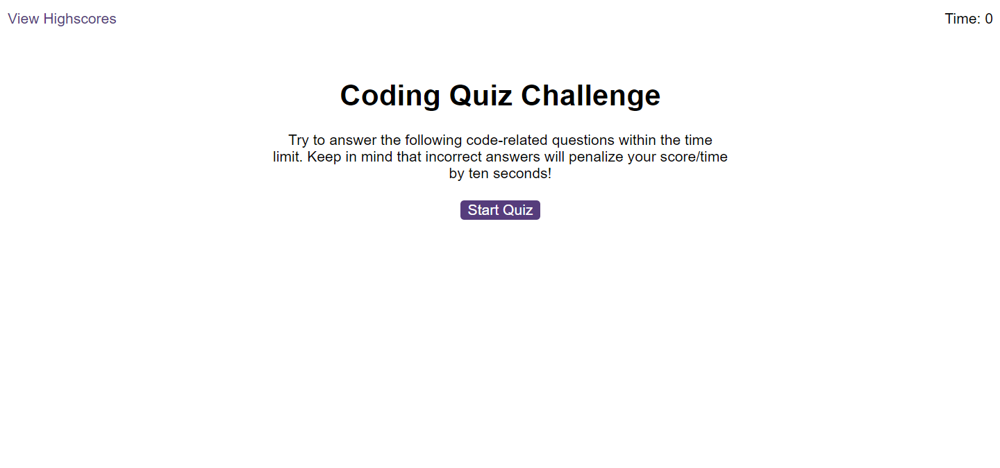
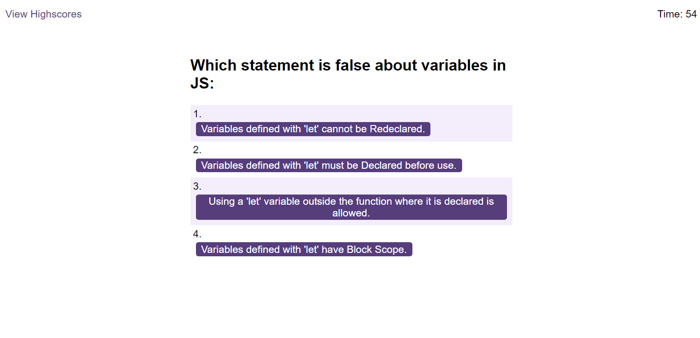
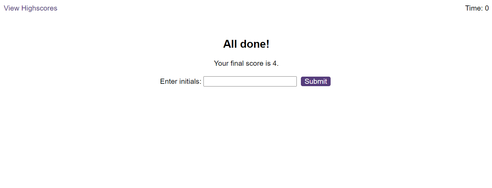
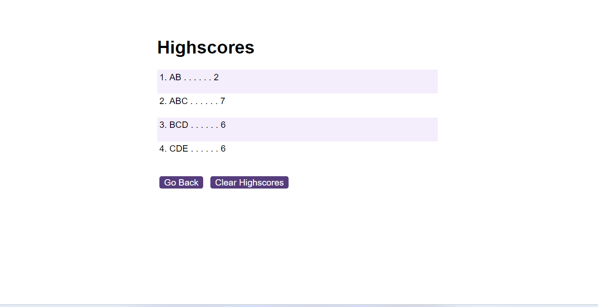

# web-APIs-code-quiz
Timed coding quiz with multiple-choice questions.

## Description

In this project I created a quiz about basic concepts of JavaScript. The person taking the quiz will have 60 seconds to answer ten questions in the form of multiple choice questions. Each wrong question will penalise with a loss of 10 seconds in the counter. After each question is answered clicking the right answer, feedback will appear on the screen informing if the answer was right or wrong.
At the end of the quiz the screen will show the score obtained and the score will be stored locally.

## Usage

Press start in the presentation screen, read the questions and click the right answer from the options presented on screen. The link to the deplyed application is:
https://pedrobe9.github.io/web-APIs-code-quiz/

## License

MIT license.

